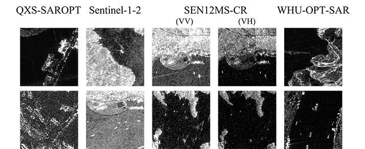
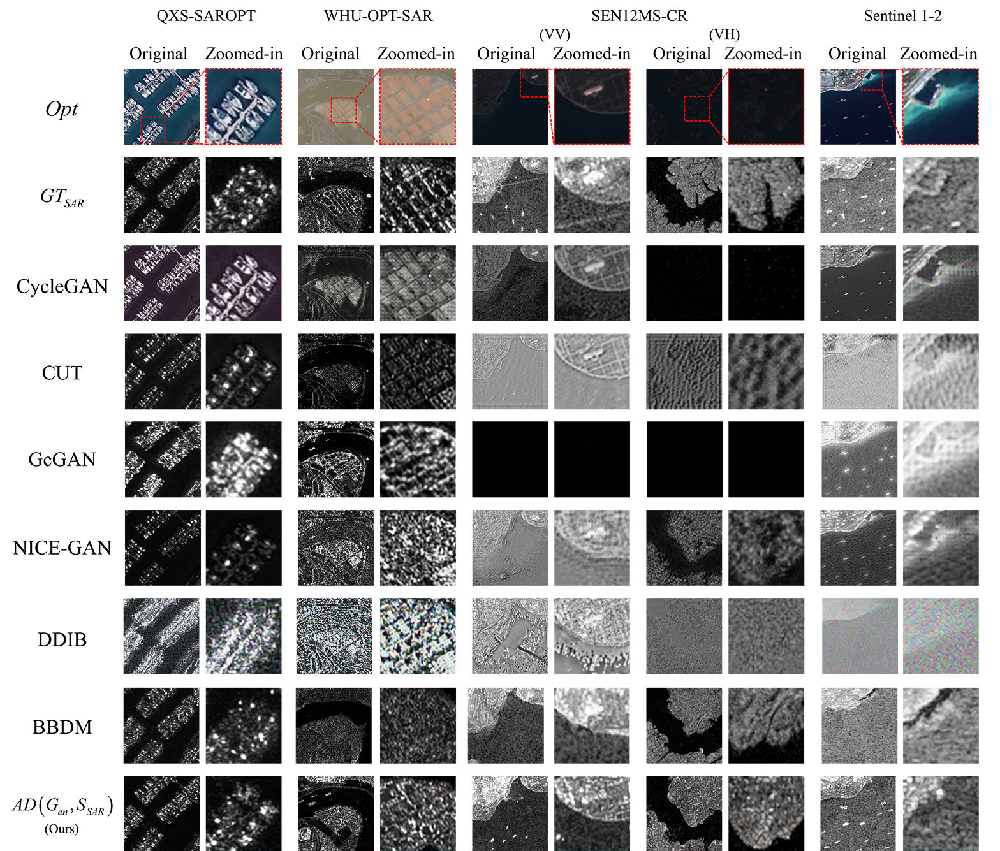
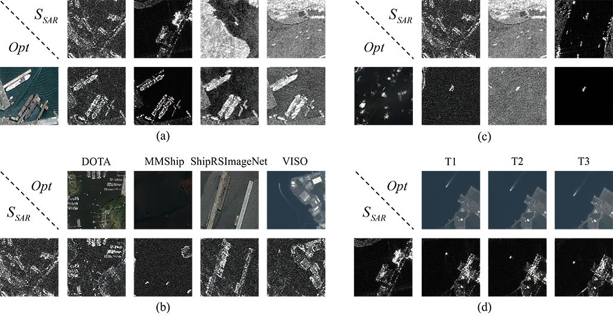

# Phy-OSShip-MS Dataset 🚢

[](https://creativecommons.org/licenses/by-nc/4.0/)
[]()

Official repository for the paper: **"Construction of a Paired Optical-SAR Ship-Containing Dataset via Hierarchical Physics-Guided Style Transfer"**.

This project addresses the scarcity of high-quality paired Optical-SAR datasets for cross-modal ship detection by introducing a novel physics-guided generation framework.

---

## 📅 Project Roadmap

- [x] **Sample Dataset**: Generated multi-style paired Optical-SAR samples.
- [x] **Visual Comparisons**: Performance evaluation against SOTA methods.
- [ ] **Full Dataset Release**: Complete Phy-OSShip-MS dataset (Upon acceptance).
- [ ] **Methodology Implementation**: Core generation code (Upon acceptance).

---

## 📊 Visual Results & Dataset Preview

### 1. Style Reference Library
To enhance sensor adaptability and prevent overfitting to specific texture patterns, we constructed a style reference library by selecting representative SAR images from various real-world datasets (e.g., QXS-SAROPT, Sentinel-1/2, SEN12MS-CR, WHU-OPT-SAR).
<p align="center">
  
  <br>
  <em>Figure 1: The SAR Style Reference Library.</em>
</p>

### 2. Method Comparison
We compare our physics-guided results with mainstream image-to-image translation models to demonstrate the significant advantages in balancing visual fidelity and physical consistency.
<p align="center">
  
  <br>
  <em>Figure 2: Visual comparison of different methods for Optical-to-SAR image translation.</em>
</p>

### 3. Dataset Diversity (Samples Grid)
Our dataset covers various maritime scenarios, ship scales, and environmental conditions across multiple source domains (DOTA-Ship, MMShip, ShipRSImageNet, VISO).
<p align="center">
  
  <br>
  <em>Figure 3: Representative paired samples from the Phy-OSShip-MS dataset across different source domains.</em>
</p>


---

## 📂 Repository Structure

```text
.
├── assets/                  # Figures for README (Comparisons, Grids, etc.)
│   ├── comparison.png
│   ├── samples_grid.jpg
│   └── style_reference_library.jpg
├── data_samples/            # Representative paired samples for inspection
│   ├── DOTA-Ship/           # Samples derived from DOTA dataset
│   │   ├── Optical/         # Original optical images
│   │   └── SAR_Generated/   # Physics-guided generated SAR images
│   ├── MMShip/              # Samples derived from MMShip dataset
│   │   ├── Optical/
│   │   └── SAR_Generated/
│   ├── ShipRSImageNet/      # Samples derived from ShipRSImageNet
│   │   ├── Optical/
│   │   └── SAR_Generated/
│   ├── VISO/                # Samples derived from VISO dataset
│   │   ├── Optical/
│   │   └── SAR_Generated/
│   └── StyleImages/         # Selected SAR style images used for transfer guidance
├── LICENSE                  # CC BY-NC 4.0
└── README.md
